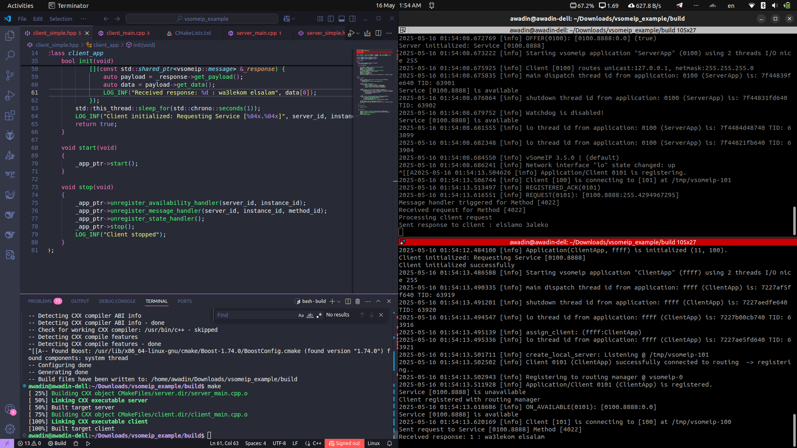
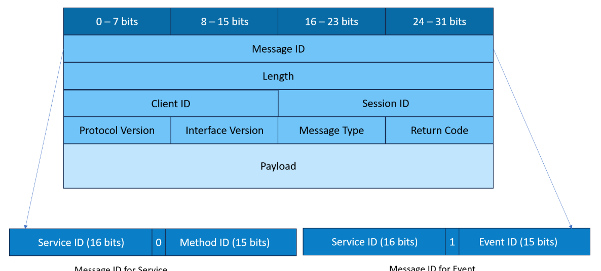

# 01_Client_Server_Simple_RequestResponse

This project demonstrates a simple SOME/IP client-server application using the vsomeip library. It implements a request-response communication pattern where a client sends a request to a server’s method (`Service ID: 0x0100`, `Instance ID: 0x8888`, `Method ID: 0x4022`), and the server responds with a payload. The project is designed as a learning tool for studying SOME/IP and vsomeip, particularly for automotive communication protocols.

## Project Overview

SOME/IP (Scalable service-Oriented MiddlewarE over IP) is a communication protocol widely used in automotive systems for service-oriented communication, enabling efficient data exchange between Electronic Control Units (ECUs). This project uses the vsomeip library to create a server that offers a service and a client that requests it, demonstrating a fundamental SOME/IP pattern: request-response communication.

The server:

- Offers a service identified by `Service ID: 0x0100` and `Instance ID: 0x8888`.
- Registers a handler for `Method ID: 0x4022` to process client requests.
- Sends a response with a sample payload (`{0x01}`).

The client:

- Discovers and requests the service using SOME/IP Service Discovery (SD).
- Sends a request to `Method ID: 0x4022` with a sample payload (`{0x00}`).
- Processes the server’s response and logs the received payload.

This project was developed to study SOME/IP concepts, including service discovery, method calls, frame structure, and vsomeip configuration, making it a practical example for learning automotive communication protocols.




## About vsomeip

vsomeip is an open-source implementation of the SOME/IP protocol, developed by the COVESA (Connected Vehicle Systems Alliance) community. It provides a C++ library for building SOME/IP-based applications, primarily for automotive and embedded systems. vsomeip enables developers to implement service-oriented communication, where applications offer and consume services over IP networks, typically using UDP or TCP.

### Key Concepts in vsomeip

- **Services and Instances**: A service is a logical entity (e.g., a set of functions or data) identified by a `Service ID` (16-bit). Each running instance of a service has an `Instance ID` (16-bit), allowing multiple instances of the same service to coexist. In this project, the server offers a service with `Service ID: 0x0100` and `Instance ID: 0x8888`.
- **Methods, Events, and Fields**: SOME/IP supports three communication patterns:
  - **Methods**: Remote procedure calls (RPCs) invoked by clients, identified by a `Method ID` (16-bit). This project uses a method (`Method ID: 0x4022`) for request-response.
  - **Events**: Notifications sent to subscribed clients when data changes.
  - **Fields**: Data attributes with getter, setter, and notifier functions.
  - This project focuses on methods, where the client calls the server’s method, and the server responds.
- **Request-Response Communication**: A client sends a `REQUEST` message to invoke a server’s method, and the server responds with a `RESPONSE` message. vsomeip handles message routing, ensuring requests reach the correct service instance. This project demonstrates this pattern with a client request to `Method ID: 0x4022` and a server response.
- **Configuration**: vsomeip uses JSON configuration files (e.g., `vsomeip.json`) to define network settings, such as IP addresses, ports, and protocols (UDP/TCP). The project’s `vsomeip.json` configures the service to use UDP on `127.0.0.1:30490` and assigns unique application IDs (`0x1111` for ServerApp, `0x2222` for ClientApp).

### vsomeip Frame Content

SOME/IP messages in vsomeip are structured as frames, consisting of a header and a payload. The header contains metadata about the message, while the payload carries application-specific data. Understanding the frame structure is crucial for analyzing SOME/IP communication, especially when debugging with tools like Wireshark.

#### SOME/IP Frame Structure



A SOME/IP frame has the following components:

1. **Header** (16 bytes):

   - Message ID (4 bytes)

     : Combines 

     ```
     Service ID
     ```

      (16-bit) and 

     ```
     Method/Event ID
     ```

      (16-bit). For methods, the 

     ```
     Method ID
     ```

      identifies the specific function. In this project:

     - `Service ID: 0x0100`, `Method ID: 0x4022`.
     - Message ID = `0x01004022` (concatenated).

   - **Length (4 bytes)**: Total length of the message (header + payload) in bytes, excluding the first 8 bytes of the header (Message ID and Length). For a payload of 1 byte (e.g., `{0x00}`), Length = 8 (remaining header) + 1 = 9.

   - **Request ID (4 bytes)**: Combines `Client ID` (16-bit) and `Session ID` (16-bit) to uniquely identify a request-response pair. vsomeip assigns `Client ID` based on the application (e.g., `0x0101` for ClientApp) and increments `Session ID` for each request.

   - **Protocol Version (1 byte)**: Typically `0x01` for SOME/IP version 1, used in vsomeip 3.5.5.

   - **Interface Version (1 byte)**: Version of the service interface, set to `0x01` in this project.

   - Message Type (1 byte)

     : Indicates the message type:

     - `0x00`: REQUEST (client to server).
     - `0x01`: REQUEST_NO_RETURN (fire-and-forget).
     - `0x02`: NOTIFICATION (event).
     - `0x80`: RESPONSE (server to client).
     - This project uses `0x00` for client requests and `0x80` for server responses.

   - **Return Code (1 byte)**: Indicates the result of the request (e.g., `0x00` for OK). Set to `0x00` in this project for successful responses.

2. **Payload** (variable length): Application-specific data. In this project:

   - Client request payload: `{0x00}` (1 byte).
   - Server response payload: `{0x01}` (1 byte).

#### Frame Content in This Project

In the project, vsomeip constructs SOME/IP frames as follows:

- **Client Request Frame**:
  - **Message ID**: `0x01004022` (`Service ID: 0x0100`, `Method ID: 0x4022`).
  - **Length**: 9 bytes (8 bytes remaining header + 1 byte payload).
  - **Request ID**: Combines `Client ID` (e.g., `0x0101`, assigned by vsomeip) and `Session ID` (e.g., `0x0001`, incremented per request).
  - **Protocol Version**: `0x01`.
  - **Interface Version**: `0x01`.
  - **Message Type**: `0x00` (REQUEST).
  - **Return Code**: `0x00` (not used in requests).
  - **Payload**: `{0x00}` (set via `create_payload` and `set_data` in `client_simple.hpp`’s `send_request`).
  - vsomeip API: The client uses `create_request`, `set_service(0x0100)`, `set_instance(0x8888)`, `set_method(0x4022)`, and `send` to build and send this frame.
- **Server Response Frame**:
  - **Message ID**: `0x01004022` (same as request to match the method).
  - **Length**: 9 bytes (8 bytes remaining header + 1 byte payload).
  - **Request ID**: Matches the client’s Request ID (e.g., `0x01010001`) to correlate the response.
  - **Protocol Version**: `0x01`.
  - **Interface Version**: `0x01`.
  - **Message Type**: `0x80` (RESPONSE).
  - **Return Code**: `0x00` (success).
  - **Payload**: `{0x01}` (set via `create_payload` and `set_data` in `server_simple.hpp`’s `on_message_handler`).
  - vsomeip API: The server uses `create_response(request)` to inherit the Request ID and Message ID, sets the payload, and calls `send`.

### vsomeip in This Project

The project leverages vsomeip to implement a minimal but functional SOME/IP application:

- **Application Creation**: Both server and client create vsomeip applications (`ServerApp` and `ClientApp`) using `vsomeip::runtime::get()->create_application()`. These applications initialize with configurations from `vsomeip.json`.
- **Service Offering**: The server calls `offer_service(0x0100, 0x8888)` to advertise its service via SOME/IP-SD. It also registers an availability handler (`on_message_avail`) to log service state changes, useful for debugging.
- **Request Handling**: The server registers a message handler for `Method ID: 0x4022` using `register_message_handler`. When a client request arrives, the handler creates a response with a payload (`{0x01}`) and sends it back using `send()`.
- **Service Discovery and Request**: The client uses `request_service(0x0100, 0x8888)` to find the server’s service. A state handler (`register_state_handler`) ensures the request is sent after the client registers with the routing manager, and an availability handler triggers the request when the service is available.
- **Payloads**: Both client and server use vsomeip payloads (`create_payload`) to send data. The client sends `{0x00}`, and the server responds with `{0x01}`, demonstrating data exchange.
- **Logging**: The project includes custom logging macros (`LOG_INF`, `LOG_ERR`) to trace initialization, service discovery, and request-response events, aiding in understanding vsomeip’s behavior.

## Directory Structure

```
vsomeip-request-response-example/
├── client_main.cpp      # Client entry point
├── client_simple.hpp    # Client class definition (handles requests and responses)
├── CMakeLists.txt       # Build configuration for CMake
├── server_main.cpp      # Server entry point
├── server_simple.hpp    # Server class definition (offers service and handles requests)
├── vsomeip.json         # vsomeip configuration (network and application settings)
├── README.md            # Project documentation
```

## Request-Response

The core functionality is the request-response interaction:

- **Server Setup**: Initializes a vsomeip application (`ServerApp`), offers a service (`0x0100`, `0x8888`), and registers a handler for `Method ID: 0x4022`. The handler processes requests and sends a response with payload `{0x01}`.
- **Client Setup**: Initializes a vsomeip application (`ClientApp`), requests the service, and sends a request to `Method ID: 0x4022` when the service is available. It logs the server’s response (`{0x01}`).
- **Frame Content**: The client’s `REQUEST` frame has `Message ID: 0x01004022`, `Message Type: 0x00`, and payload `{0x00}`. The server’s `RESPONSE` frame uses the same `Message ID`, `Message Type: 0x80`, matching `Request ID`, and payload `{0x01}`.
- **Timing**: The client uses a state handler and availability handler to ensure the request is sent only after the service is discovered, with a 1-second delay to avoid race conditions.
- **Debugging**: Logs trace the process, e.g., “Server initialized: Service [0100.8888]”, “Sent request to Service [0100.8888] Method [4022]”, and “Received response: 1”.

This pattern is typical in automotive systems, where ECUs request data or actions from other ECUs, and vsomeip simplifies its implementation.


---------------

### References 

https://github.com/COVESA/vsomeip

https://www.slideshare.net/DaiYang/scalable-serviceoriented-middleware-over-ip

https://www.embien.com/automotive-insights/scalable-service-oriented-middleware-over-ip-an-introduction

https://www.embien.com/automotive-insights/some-ip-protocol-communication-a-comprehensive-guide

https://www.engineersgarage.com/some-ip-protocol/